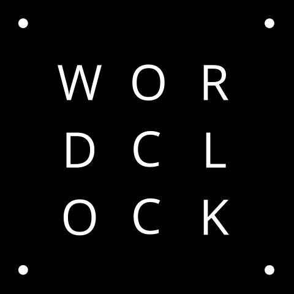
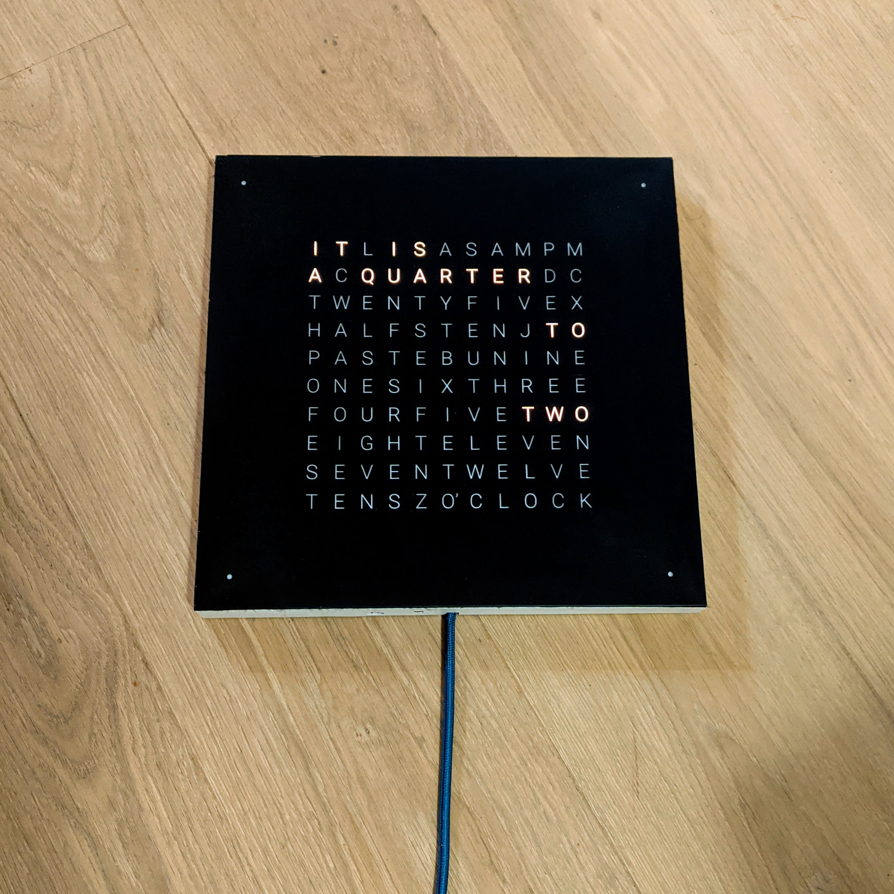
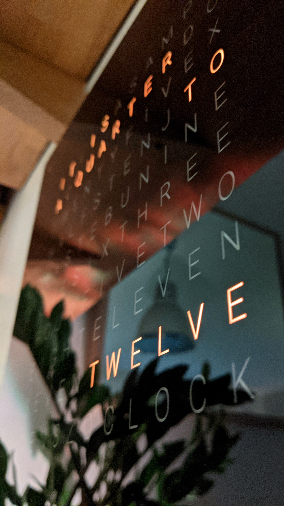
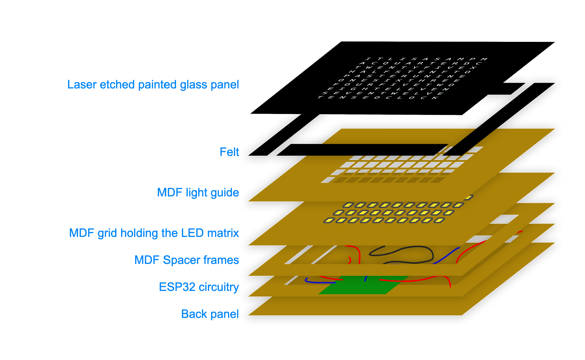
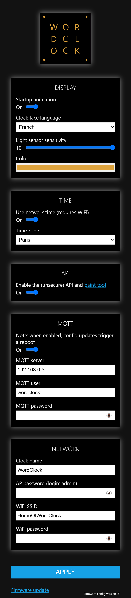

# Wordclock
ESP32 based DIY wordclock project

 
 Another take on the classic DIY word clock. This one requires a laser cutter but promises a very clean result and is quite cheap to make (about 50 €) while being feature packed with its 11x10 RGB LED matrix, RTC module (time setting survives power loss), light sensor, WiFi connectivity and more.

This project was designed for the tools available in our makerspace. The largest square that can be cut in an Epilog Mini laser cutter is approximately 30x30cm, so the clock is designed around that constraint.

## Table of Contents

- [Wordclock](#wordclock)
  * [Project overview](#project-overview)
    + [Hardware](#hardware)
    + [Software](#software)
  * [Bill Of Materials](#bill-of-materials)
    + [Electronics](#electronics)
    + [Frame](#frame)

## Project overview

### Hardware 

Building the clock from scratch involves mostly laser cutting and soldering. It is not technically challenging if you have basic soldering skills (and access to a laser cutter), but it does take time on both fronts. The project's hardware can be broken down in 3 major elements:

- __The faceplate__ is a glass panel from a cheap picture frame, that is spray painted on its back, then laser etched to mark the letters. The templates and instructions are located in [the faceplate subdirectory](hardware/faceplate/README.md).
- __The frame__ is a sandwich of laser-cut MDF planks. If could be done with CEC or 3d printing too. It holds everything together and most importantly the LED matrix. It has little wells for each LED to channel the light to the letters on the faceplate. The templates and assembly instructions are located in [the frame subdirectory](hardware/frame/README.md).
- __The electronics__ revolve around a WiFI enabled ESP32 development board and a matrix of 114 LEDs made from an LED strip. There is also an RTC module to keep track of time, and a lignt sensor (LDR). The schematics and instructions for assembly are located in [the electronics subdirectory](hardware/electronics/README.md).

You can oviously choose to customize any of the provided templates to eg create a different faceplate, or adapt the frame to your specific needs (change the LED layout, add extra sensors, etc).

### Software

The provided [source code](software/README.md) is using Arduino IDE with the [arduino-esp32 library](https://github.com/espressif/arduino-esp32) and a few others. It runs a web server though a WiFi captive portal in order to easily configure the clock from a computer or smartphone, and perform OTA firmware update ([demo video](https://youtu.be/WF_X5soabm0)).

  

It is, of course, entirely possible to ditch that code entirely and use [ESPHome](https://esphome.io/) or [MicroPython](https://docs.micropython.org/en/latest/esp32/tutorial/intro.html) instead. 

## Bill Of Materials

### Electronics

| Designation | Sample purchase link | Price |  
| ----------- | -------------------- | ------|  
ESP32 (WROOM32) microcontroller | [amazon.fr](https://www.amazon.fr/gp/product/B06XWVS2SJ/ref=ox_sc_act_title_6?smid=A3OY00ITR6XRNR&psc=1) | 5,99 € |
DS3231 RTC module | [amazon.fr](https://www.amazon.fr/gp/product/B07DK5M5VW/) | 3,66 € |
Level shifter 3.3 -> 5v | [amazon.fr](https://www.amazon.fr/gp/product/B07LG6RK7L) | 0,80 € |
RGB addressable LEDs (WS2812), 60 per meter, 2 meters roll | [aliexpress.com](https://www.aliexpress.com/item/32958709980.html?spm=2114.search0104.3.35.2a616adcbmvvSU&ws_ab_test=searchweb0_0%2Csearchweb201602_4_10065_10130_10068_10547_319_317_10545_10696_10084_453_454_10083_10618_10307_10821_537_10302_536_10059_10884_10887_321_322_10103%2Csearchweb201603_53%2CppcSwitch_0&algo_expid=2a4f6a2a-c5bc-4435-a3ff-21b692aed5ff-7&algo_pvid=2a4f6a2a-c5bc-4435-a3ff-21b692aed5ff) | 4,17 € |
1000 uF capacitor | [amazon.fr](https://www.amazon.fr/gp/product/B01M4IUST7) | 0,40 € |
Power supply (5V, 6A) | [aliexpress.com](https://fr.aliexpress.com/item/32835554243.html) | 6,99 € |
Female barrel plug | [amazon.fr](https://www.amazon.fr/gp/product/B06XPBKC37) | 0,86 € |
Light dependent resistor (LDR 5537) | [amazon.fr](https://www.amazon.fr/gp/product/B074QLFCF6/) | 0,08 € |
Resistor 10k |
Perfboard | [conrad.fr](https://www.conrad.fr/p/platine-dexperimentation-rademacher-wr-typ-908-1-vk-c-908-1-ep-epoxy-l-x-l-80-mm-x-50-mm-35-m-pas-254-mm-1-pcs-527309) | 3,36 € |
Breakaway header pins | [amazon.fr](https://www.amazon.fr/gp/product/B07C3W8DGZ/ref=ppx_yo_dt_b_asin_title_o03_s00?ie=UTF8&psc=1) | 0,14 € |
Wiring (silicon coating is recommended) |
Solder |  
Kapton + Electrical tape |
Heatshrink tubing |
Hot glue gun + glue sticks |

### Frame

| Designation | Sample purchase link | Price |  
| ----------- | -------------------- | ------| 
MDF planks, ~30.5 cm by 30.5+ cm | 
Picture frame with glass panel, 30 by 30 cm | [leroymerlin.fr](https://www.leroymerlin.fr/v3/p/produits/cadre-clip-30-x-30-cm-e1500701594) | 2,99 € |
Wood glue |
Clamps |
Spray paint (acrylic) |
Edgeband |
1mm black felt layer | [amazon.fr](https://www.amazon.fr/dp/B07LFJNLZ9/) | 1,11 € |
Double sided sticky tape | [amazon.fr](https://www.amazon.fr/dp/B077N3KV8K) | 7,49 € |
Ultra low profile VELCRO® strip or similar | [amazon.fr](https://www.amazon.fr/dp/B0728LKFGM/ref=pe_3044141_189395771_TE_dp_1) | 26 € |
Copper tape 51mm X 20m (optional) | [amazon.fr](https://www.amazon.fr/gp/product/B01MTQA0O6/ref=ppx_od_dt_b_asin_title_s00?ie=UTF8&psc=1) | 18,98 € |