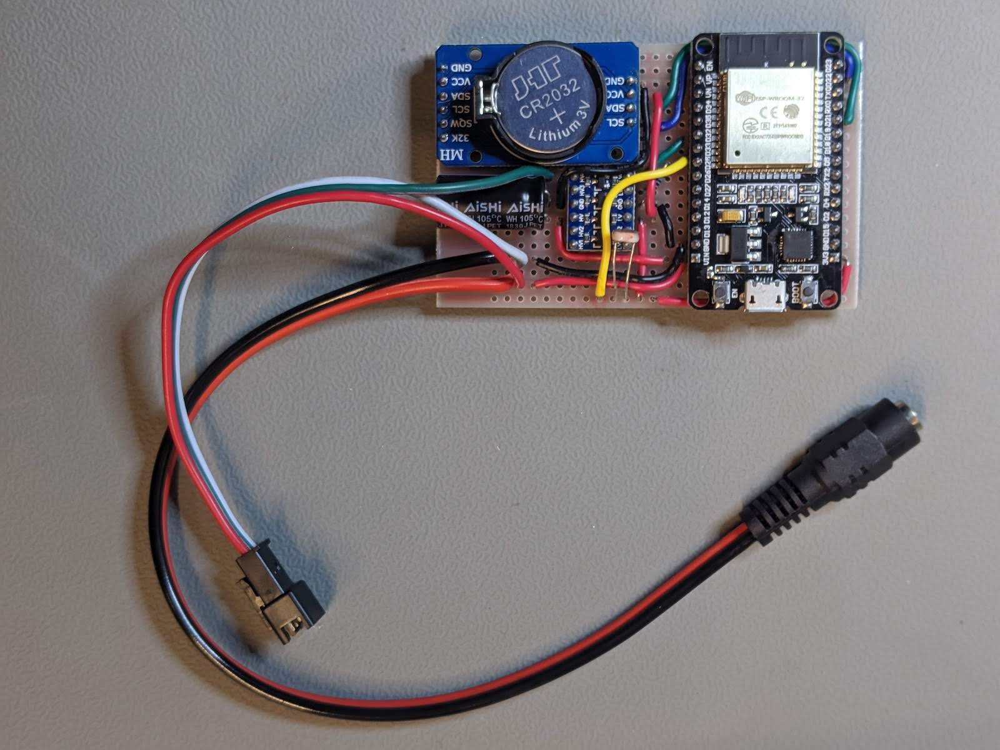
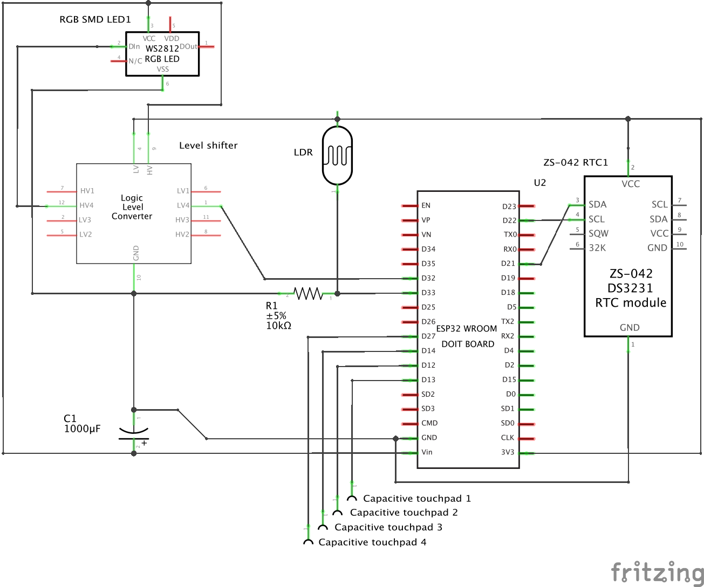
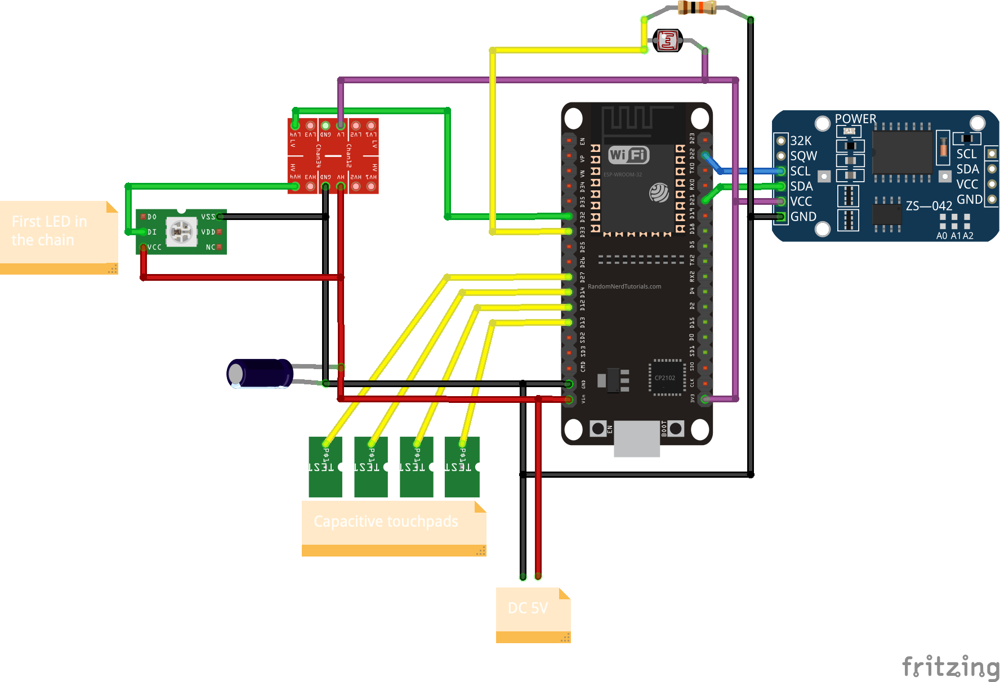
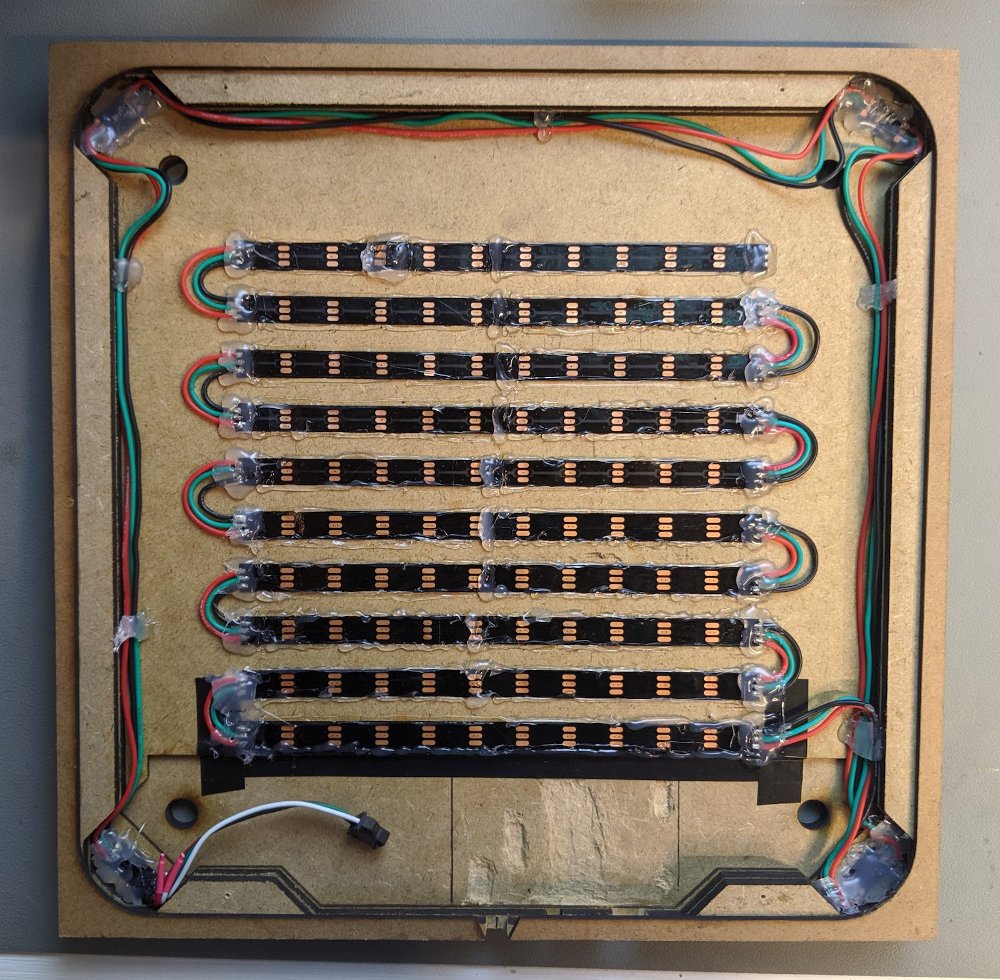

# Electronics

This section of the [Wordclock project](../../README.md) covers the wiring of the electronics and the LED matrix.

## Circuit

See [here](../../README.md##bill-of-materials) for components list. 

Everything fits fairly easily on the proto board which is 80mm x 50mm. It is possible to make it wider than 80mm, but the short side (50mm) is physically constrained by the frame. Thickness must also kept to a minimum (the clock module is probably the thickest part with its battery holder).

:warning: _This prototype uses a 30 pin ESP32 board, and in this picture it had the LDR incorrectly wired to GPIO 25_

### Schematic

- Power is provided through a DC jack by an external 5V power supply that we recommend should be able to output 6A. This is necessary to provide enough current to light up all 114 RGB leds at full brightness. This is not strictly necessary with the base function of the clock, but provides legroom for alternate uses of the LED matrix. If powering the circuit through the ESP's USB port instead, be careful not to light up more than a handful of LEDs at a time.

- The ESP32 board illustrated here has 36 pins. There are many alternate ways of wiring this circuit as we are not using every available pin. There are also 30p pin ESP32 dev boards wich should work with the same wiring. You can check this great [pinout reference on randomnerdtutorials.com](https://randomnerdtutorials.com/esp32-pinout-reference-gpios/) if you need to make changes. 

- DS3231 is a temperature compensated I2C clock operating at 3.3V. It'll keep track of time with decent accuracy and its CR2032 backup battery prevents the time setting from being reset due to power loss. It's connected to the ESP32 via the default SDA and SCL GPIO pins (21 and 22). This module is actually optional since the ESP32 can get the time via NTP over WiFi, but with it, it works as a regular wall clock that doesn't need an internet connexion to operate.

- The level shifter boosts the signal sent from GPIO pin 32 to the LED matrix from 3.3 to 5V (only the first LED is represented on the schema, the remaining 113 are simply daisy chained behind it). While the level shifter might not be necessary depending on your LED strip, it is very cheap and doesn't hurt either way. More info [here](https://learn.adafruit.com/neopixel-levelshifter/shifting-levels).

- The C1 capacitor is here to protect the LEDs, it prevents an initial onrush of current from damaging them. See [here](https://learn.adafruit.com/adafruit-neopixel-uberguide/powering-neopixels) for further details.

- The LDR (light sensor) is wired to one of the Analog to Digital Converters (ADC) of the ESP32. We use GPIO 33 but any other GPIO from the ADC1 group will do. Do not use any of the ADC2 pins or you won't be ale to use WiFi simultaneously. R1 is a pulldown resistor.

- Capacitive touchpads are meant to be wired to the 4 corners of the clock. It's a built in feature of the ESP32. At the time of writing, we were not able to get this to work consistently and are not using them but they're here for information and should be considered optional.

### Breadboard

Here's another view of the circuit, which can be used as an easier reference to place everything on the proto board. The exact way you wire this on the proto board is up to you, but the LDR and USB port of the ESP32 should be exposed on one of the larger sides.

## LED Matrix

 We use a strip of 60 LEDs per meter (12mm spacing or a LED every 0.65"/17mm) which provides adequate spacing for this build. The strip is cut into 10 segments of 11 LEDs which are wired as a daisy chain. At one end of the chain, 4 additional LEDs are placed in each corner of the frame and mark the 4 minutes between text updates (eg from 'quarter' to 'twenty').

The LED modules take +5V, GND and DIN (data line). It's okay to daisychain everything for simpler wiring, but you might notice slightly dimmer lights towards the end of the chain. For better power distribution, you can feed +5V from the middle of each segment or make small groups of segments. Only the data line actually needs to be daisychained.

The LED strips are hotglued to the dedicated lasercut support (see the [frame building instructions](../frame/README.md)).

### Assembly video

Here's a [LED matrix assembly video](https://youtu.be/uqOhGHvoc6M).