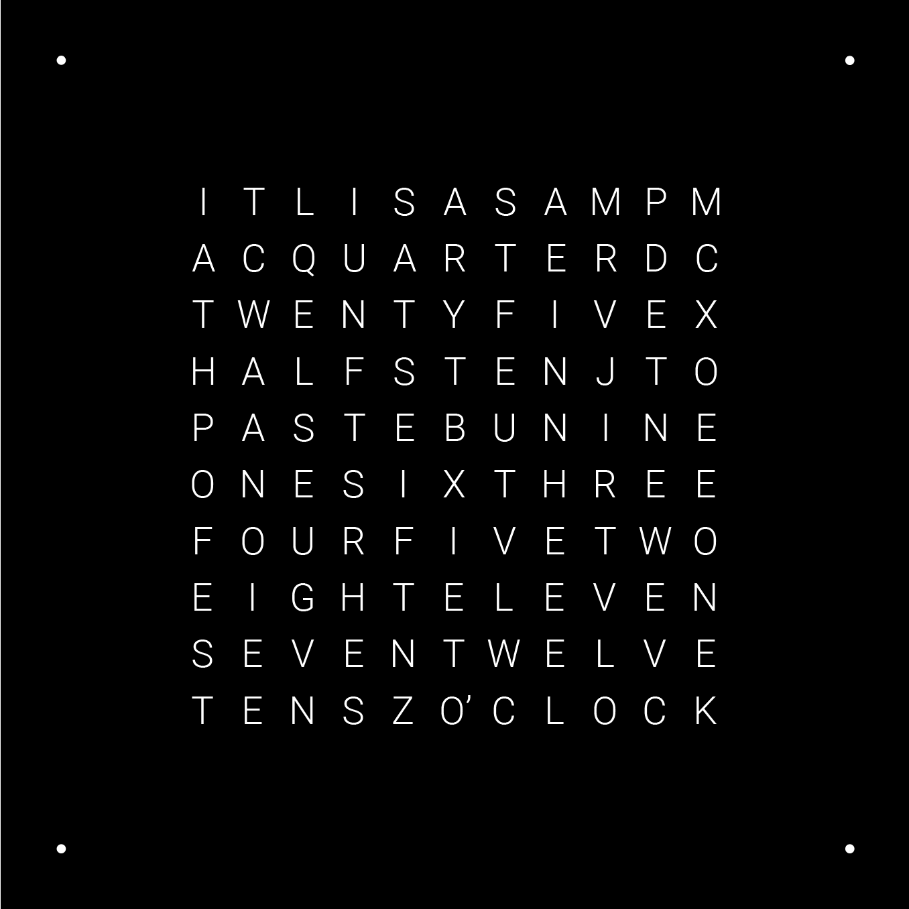
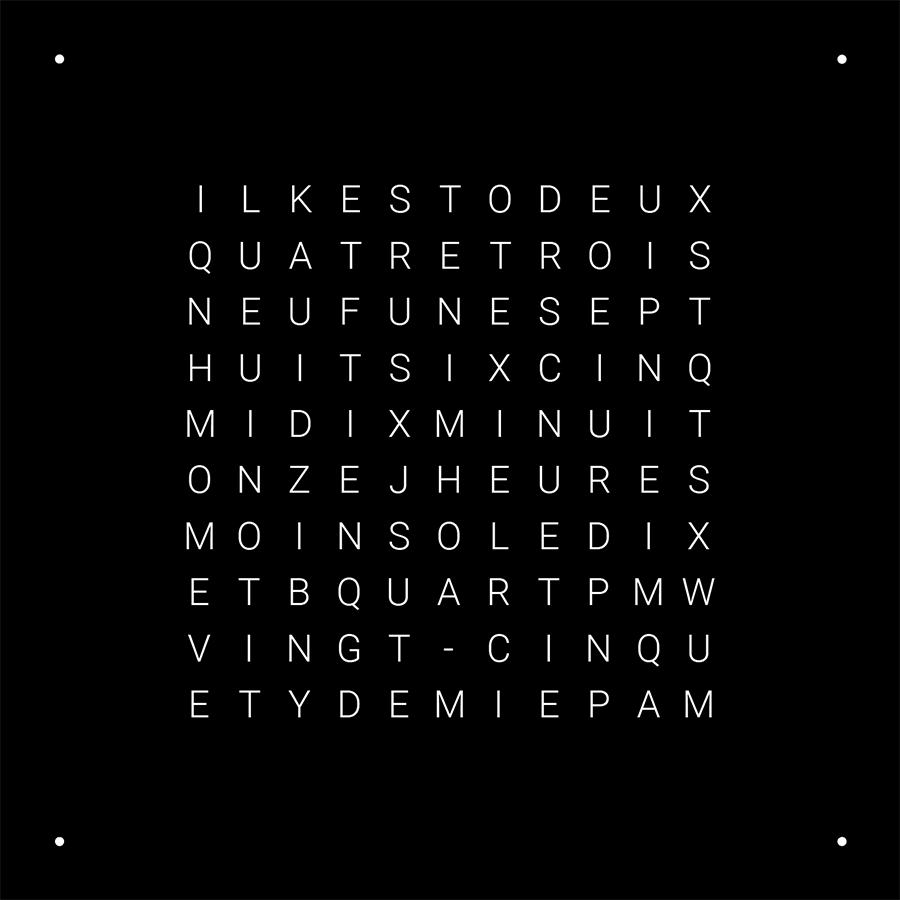
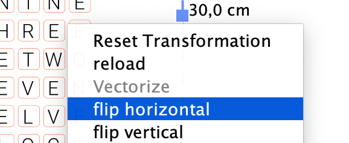
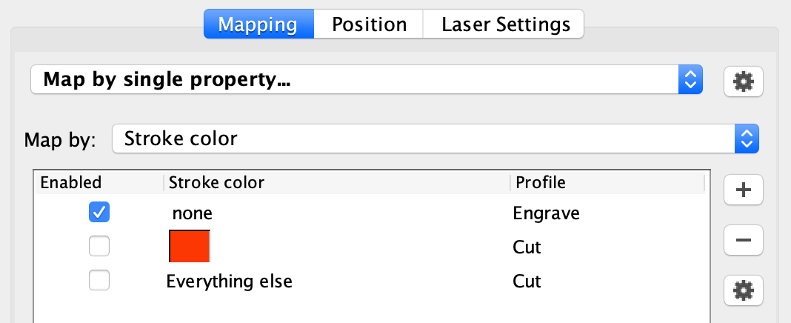
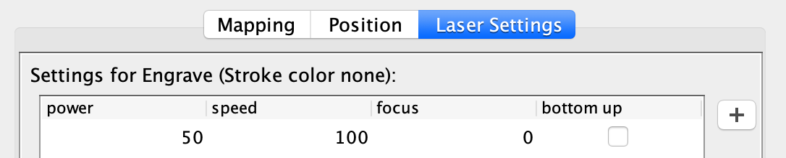
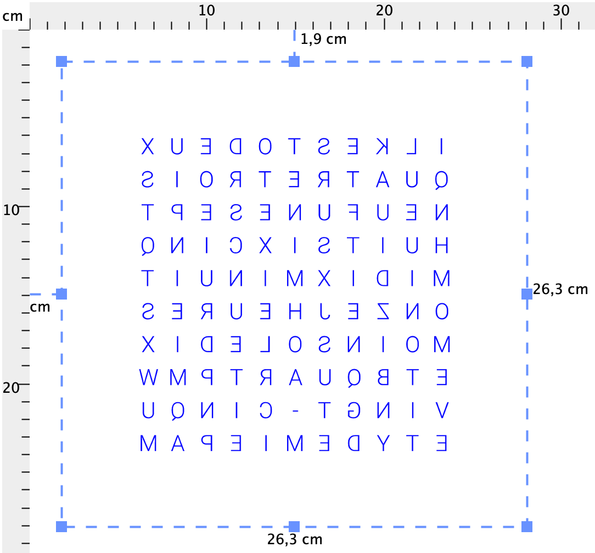

# Faceplate

This section of the [Wordclock project](../../README.md) covers the glass faceplate. For final assembly with the frame, see [here](../frame/#wordclock-assembly).

To create the faceplate, we need to paint one side of the clear glass square we got from the picture frame (see [BOM](../../README.md#bill-of-materials) ). It's the backside of the clock's faceplate. 

We will then laser-etch the inverted letters on the painted side, removing the paint (and slightly frosting the glass in the process). 

## Table of Contents

- [Painting the glass](#painting-the-glass)
- [Vector template files](#vector-template-files)
- [Custom template](#custom-template)
  * [Creating a faceplate template from scracth in Inkscape](#creating-a-faceplate-template-from-scracth-in-inkscape)
- [Notes for using Visicut](#notes-for-using-visicut)
  * [Mirror before etching](#mirror-before-etching)
  * [Etching the template](#etching-the-template)
  * [Final advice](#final-advice)

## Painting the glass

Several options were tested for this project:

1. Acylic spray paint (preferably onw that can stick to glass, [example reference](https://www.amazon.fr/edding-e5200-peinture-toutes-surfaces/dp/B06XRDN8MK))
2. Acrylc surface primer applied with an airbrush ([example reference](https://www.amazon.fr/Vallejo-Surface-Primer-73602-Black/dp/B07VT9LFSH))
3. Acrylic paint applied with a roller (not recommended: the coat is too thick and uneven for the etching to work efficiently)

Options 1 and 2 have been tested and work well. Spray can is the easiest and fastest method, but can produce toxic exausts. If the paint is not explicitly designed for glass, it might still work could peel off with time.

Clean the glass plate very carefully prior to painting it, making sure you remove any dust, as dust specks might get stuck between the glass and the paint coat, which will be quite visible from the other side.

:warning: _Be careful about safety requirements. Check the recommendations for the paint you chose. Wear a mask and paint in a well ventilated area._

## Vector template files

The project currently has classic templates for English and French languages.

Both templates contain at least one of each letter of the latin alphabet, so that the LED matrix could be used as a ouija board to display messages (with appropriate software).

<table>
  <tr>
    <th>Language</th>
    <td>English</td>
    <td>French</td>
  </tr>
  <tr>
    <th>Preview</th>
    <td align="center"></td>
    <td align="center"></td>
  </tr>
  <tr>
    <th>Ready to etch (scaled, outlines, mirrored)</th>
    <td><a href="glass_template_EN_mirrored.svg">glass_template_EN_mirrored.svg</a></td>
    <td><a href="glass_template_FR_mirrored.svg">glass_template_FR_mirrored.svg</a></td>
  </tr>
  <tr>
    <th>SVG file, scaled (font, see below)</th>
    <td><a href="glass-template-EN-font.svg">glass-template-EN-font.svg</a></td>
    <td><a href="glass-template-FR-font.svg">glass-template-FR-font.svg</a></td>
  </tr>
</table>

## Custom template

If you wish to create a custom template you can use the SVG files above as a starting point, or rebuild it from the MDF Cut2 frame template (from the [frame building instructions](../frame/README.md)). 

The second set of SVG files provided in the table above come with letters as vector text (using Roboto Light font by Google, which can be downloaded [here](https://fonts.google.com/download?family=Roboto) for easier editing. You'll need to install this font if you want to edit the template), and you'll have to convert the letters into outlines and mirror the file prior to sending it to the etching software. The changes you can do from these files are limited and it might be necessary to create a template from scratch, as explained below

### Creating a faceplate template from scracth in Inkscape

1. Download the [SVG file for the front layer of the clock](../frame/wordclock_frame_cut2_template_6mm_sheet.svg) and open it in Inkscape.
2. Ungroup (using the right click menu) the drawing until you can access individual square cutouts for the LED matrix.
3. Add letters to the squares that you want. Make sure to position them consistently within each square, for example by snapping them to the lower-left corner.
4. Create a new layer (Layer -> Add Layer) above the current one, select all of the symbols by shift-clicking on them and move them to the new layer (Layer -> Move selection to layer above). This gives you an easy way to hide the bottom layer that you don't want to engrave and to easily select all of the text to work with.
5. Set your letter font using the font side menu on the right and then use the arrow keys to position your letters. Make sure the vertical alignment is final, horizontally the letters should be near the middle. You should move all of the letters together to maintain consistent character baselines.
6. Select each column of the LED matrix, both squares and letters, and use distribute tool to align the letters horizontally. Operations must be relative to the selection area.
7. Add holes for the corner LEDs: make a copy of a small corner circle, reduce its size and change its fill color to black.
8. To align the filled circles with the corner cutouts, use the distribute tool again, but this time make sure to change "relative to" setting to "Biggest object". Repeat this for the other three corners and move the filled circle to the top layer as described above.
9. Finally, hide the lower layer of the SVG, select all of the characters, convert them to paths (Path -> Object to path) and mirror them horizontally (Object -> Flip horizontally). When you save the file, you will be able to use it with Visicut to engrave your painted glass plate. Flipping the SVG preemptively helps because Visicut truncates the right and bottom sides of the imported drawings, losing the required padding when mirroring.

## Notes for using [Visicut](https://visicut.org/)

Below are specific instructions for using these templates with Visicut software on an Epilog laser cutter.

You can engrave your painted face plate only once, so it’s a good idea to use a discarded piece of wood or cardboard to check the exact alignment of where the plate should be placed inside the laser cutter.

### Mirror before etching

__If you are using the Visicut-ready templates provided above, you can skip this step as the files are already mirrored.__

 Remember that we are etching the back of the glass panel, so you can either mirror the layout in Illustrator/Inkscape, or directly in Visicut by right-clicking on the drawing and selecting "flip horizontal". It is recommended to mirror your template in your editor rather than doing this later in Visicut.
 

### Etching the template

  The red outline is here to help align the template correctly and __make sure the scale is correct (300x300 mm)__. Once the template has been positioned, use the following settings to only engrave the letters: Map by single property > Stroke color, then only check "none" and select the Engrave profile.
 

 Suggested Power and Speed settings for the 40W Epilog Mini are 50-60 for power and 100 for speed. If your paint coat is thick you can bump that up to 80 power (or do multiple passes). 
 

Your final preview should look like this:

  

### Final advice

Carefully inspect the letters on your panel after the first pass. Put a paper towel on the bed of the machine under your glass plate to protect it from scratches and make it a little easier to inspect without moving the glass (which is preferable if you’re going to have to do multiple passes).

Some tiny glass shards might have been created. Although not a huge deal since that side of the panel will not be exposed in the final product, we recommend that you very gently swab the letter with a wet paper towel. In other situations we would have covered the etched areas with tape to mitigate that and cleaned up the glue residue with detergent, but this might damage the paint coat so we’ll do without. Another way to protect the etched side would be to apply a transparent vinyl on the entire surface of the glass.
