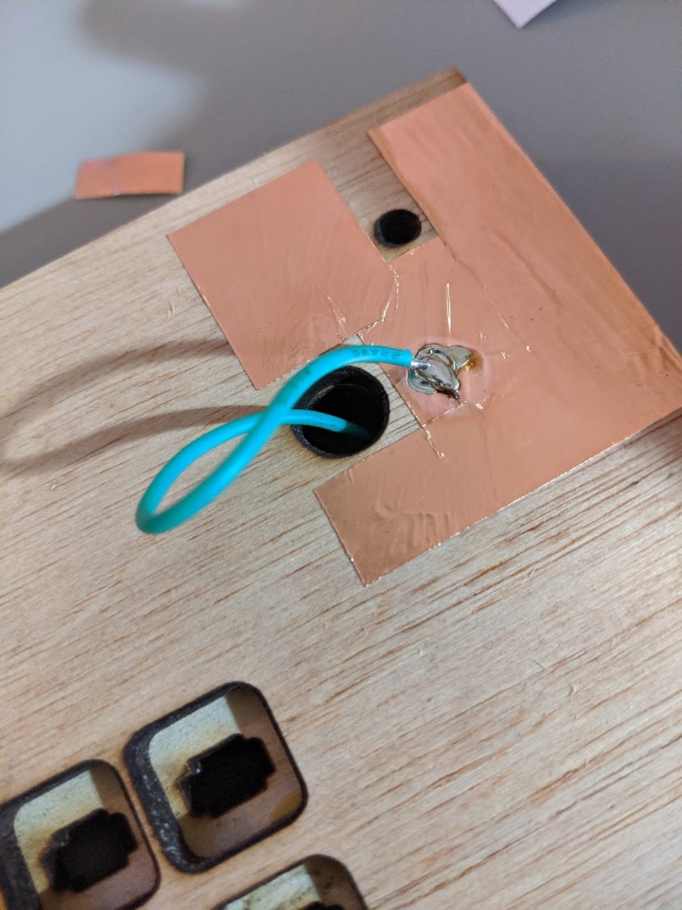
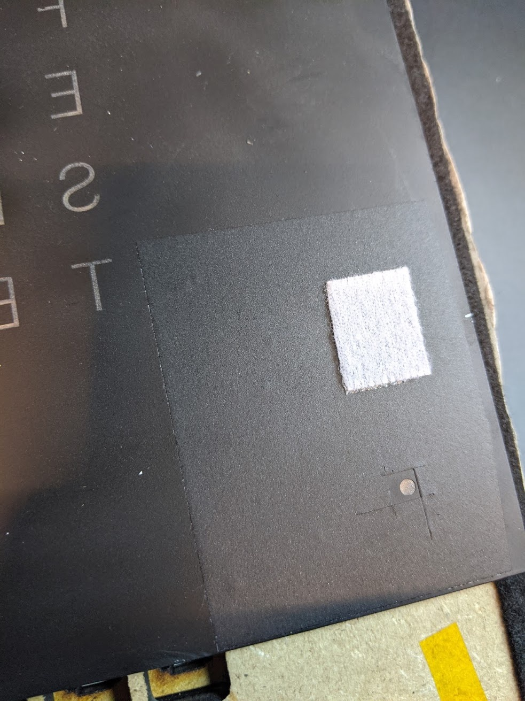

# Frame

This section of the [Wordclock project](../../README.md) covers the laser cut MDF frame of the clock, as well as the [final assembly](#worcdlock-assembly) steps.

The frame is made of sandwiched laser cut boards of 3mm and 6mm (6mm max thickness is another constraint of the 40 Watt laser cutter we had).

All MDF layers can be cut out of just 3 boards of approximately 310x310mm, one 3mm thick and the other two 6mm thick. The back panel of the original picture frame (generally 3mm thick low quality MDF) will be recycled as the back panel of the clock, and laser cut to create a hatch.

The layers are glued together using wood glue, the sides of the frames should then be sanded with large grit sandpaper so that some edgeband can be glued to the sides of the frame in order to conceal the various layers.

  
  

## Table of Contents

* [Overview](#overview)
* [MDF layers](#mdf-layers)
  + [Light wells](#light-wells)
  + [LED matrix support](#led-matrix-support)
  + [Spacers](#spacers)
  + [Back panel](#back-panel)
* [Laser cutting](#laser-cutting)
  + [Vector template files](#vector-template-files)
  + [Notes for using Visicut](#notes-for-using-visicut)
    - [Back panel template](#back-panel-template)
    - [Cut1 template (310x310x3mm MDF board)](#cut1-template-310x310x3mm-mdf-board)
    - [Cut2 template (310x310x6mm MDF board)](#cut2-template-310x310x6mm-mdf-board)
    - [Spacers template (310x310x6mm MDF board)](#spacers-template-310x310x6mm-mdf-board)
* [Frame assembly](#frame-assembly)
* [Worcdlock assembly](#worcdlock-assembly)
  + [Adding touch sensors](#adding-touch-sensors)
  + [Adding the edgebanding](#adding-the-edgebanding)
  + [Adding felt strips and diffuser](#adding-felt-strips-and-diffuser)
  + [Closing the frame](#closing-the-frame)
  + [Attaching the faceplate](#attaching-the-faceplate)

## Overview

Here's a simplified side view showing every layer of the sandwich.

  

From top to bottom:
- The glass panel aka the faceplate (covered separatley [here](../faceplate/README.md))
- A layer containing an outline made of black felt, some sticky tape or VELCRO® to hold the glass panel to the frame, a paper filter to diffuse the light, and also the capacitive touch sensors.
- The Cut 2 layer (from the 6mm board), tunneling the LED light.
- The Cut 1 layer (from the 3mm board), to which the LED strips are glued (LED matrix assembly is covered [here](../electronics/README.md#led-matrix)).
- 2 or 3 spacer layers (from the 6mm board) to provide a cavity for the mainboard. The bottom side of one of these spacers will be cut out to give access to the light sensor, USB port and power cord.
- The bottom panel, held in place with 4 screws, is the recycled back plate of the picture frame. It is also laser cut.

## MDF layers

Let's have a closer look at every laser cut layer, from top to bottom.

### Light wells

This is the topmost part of the MDF sandwich, which we call the __Cut2__ template.

It is 6mm thick and creates little wells that channel the light of each LED to the characters on the faceplate. A thinner layer with shallower wells would not provide sufficient diffusion and the letters would not be lit up uniformly.
 

### LED matrix support

 That's the 3mm thick layer which we call __Cut1__. The LED strips are glued to it. The 50mm tall hole at the bottom provides space for the ESP32 and other electronics.

 

### Spacers

  

Spacer layers are empty frames that add thickness to the clock in order to provide room for the LEDs and electronics. Spacer layers can be added at will to make the clock as thick as required. 

In order to save material, the spacer layers are cut down ito thin strips of MDF that can be assembled into a frame. This way we can cut for 3 spacer layers out of a single 30x30cm square (you should only need 2 of these).

The green rectangle in the drawing above represents the location of the 80 x 50mm proto board hosting the ESP32.

### Back panel

 We recycle the back of the picture frame and cut a hatch into it. 

The outer rim will be glued to the frame while the center part will be screwed for easy access to the electronics.

 

## Laser cutting

### Vector template files

| Layer | Template file | Speed | Notes |
| ----- | ------------- | ------| ----- |
| Back | [wordclock_frame_back_template.svg](wordclock_frame_back_template.svg) | 15 |  Place the home exactly on the top left corner of the piece. |
| Cut1 | [wordclock_frame_cut1_template_3mm_sheet.svg](wordclock_frame_cut1_template_3mm_sheet.svg) | 14 | Place the home ~2mm from the top and left border of the board. |
| Cut2 | [wordclock_frame_cut2_template_6mm_sheet.svg](wordclock_frame_cut2_template_6mm_sheet.svg) | 14 | Can require require 2 to 3 passes due to thickness, depending on MDF quality. Place the home ~2mm from the top and left border of the board. Manual focus adjustment is needed between passes. |
| Spacers | [wordclock_frame_spacers_template_6mm_sheet.svg](wordclock_frame_spacers_template_6mm_sheet.svg) | 14 | Can require 2 to 3 passes, same as above. |

_Note: speed value is the suggested setting for Epilog Mini 40W, with power at 100._

### Notes for using [Visicut](https://visicut.org/)

Below are specific instructions for using these templates with Visicut software on an Epilog laser cutter.

#### Back panel template
1. Import the file in Visicut.
2. __First__, move the template at position 0,0 in visicut (top left corner of the cutting bed in the preview).
3. __Then__, using "map by single property..." > "map by group/layer", select the black cut line only (this layer is called "cut me"). The green outline and text should disappear from the preview.
4. In the machine, position the home exactly at the top left of the board.
5. Apply suggested values in the Laser Settings tab (power 100 / speed 15).

#### Cut1 template (310x310x3mm MDF board)
1. Import the file in Visicut.
2. Move the template at position 0,0 in Visicut.
3. Set the home ~2 mm from top and left of the board in the laser cutter.
4. Apply suggested values in the Laser Settings tab (power 100 / speed 14).

#### Cut2 template (310x310x6mm MDF board)

1. Import the file in Visicut.
2. Move the template at position 0,0 in Visicut.
3. Set the home ~2 mm from top and left of the board in the Epilog.
4. 6mm board is hard to cut and will likely require more than one pass:
- 1st pass: use 14 speed / 100 power with autofocus option on in Visicut.
- 2nd pass: we’ll use the same speed/power but disable the autofocus and use manual focus to bring the board ~3 mm closer to the laser head, here are the setps for the Epilog Mini :
  * Delete the previous job (trashcan button on the control panel).
  * Unlock the laser head if needed (x/y unlock) but DO NOT set the home again.
  * Press manual focus mode button at the bottom right of the Epilog’s control panel.
  * Move the bed up with 3 short presses of the up arrow on the control panel.
  * Finally press return (u-turn shaped arrow button).
  * Uncheck “enable auto focus” in Visicut and send (Execute) the job to the Epilog.
  * Press go on the Epilog to start the 2nd pass.   Depending on the cleanliness of the optics, MDF batch your board comes from, planet alignment, tea leaves in your cup and other parameters it might be required to do a 3rd pass. Look at the bottom side of the board, if the cut isn’t fully visible: very carefully put the board back in position. DO NOT change the home settings! Wipe it with a paper towel, add another 1 mm of offset to the focus (bring the table 1mm closer to the laser head) and run the previous job again.

#### Spacers template (310x310x6mm MDF board)
Follow the same steps as for Cut1 above.

## Frame assembly

Start from the top panel (6mm __Cut2__ light wells), then glue each layer one by one using wood glue and clamps. Let it cure for an hour between layers, and repeat with the next layer (first glue the 3mm __Cut1__, then a 6mm spacer frame, then another, possibly a third one, and finally the rim of the back plate).

When adding the first spacer frame, you'll have to cut out the bottom piece to provide access to the USB port and LDR sensor, as pictured below. You'll need to do the same for the power cable in the last spacer.

  

Sand the edges of the frame to remove the burn marks and smoothen the small misalignments. The edge banding can be applied with an iron but this should be done as one of the last step, once the rest of the build is complete. If you are ready with the [electronics](../electronics/README.md) and [faceplate](../faceplate/README.md), you can proceed with the final assembly.

## Worcdlock assembly

These are the final assembly steps once the frame, [electronics](../electronics/README.md) and [faceplate](../faceplate/README.md) are completed.

  

### Adding touch sensors

__Note:__ This is an optional step. We were not able to get these to work consistently in the software at the time of writing. But it's easy to do if you have copper tape, and needs to be done prior to applying the edgebanding.

1. Take 5-6 cm of copper tape for each corner.
2. Make cutouts if necessary.
3. Bend it around the corners (top and bottom of the vertical edges). Be careful: it’s thin and tears off easily.
4. Leave at least 4 mm of uncovered wood on all 3 sides around the tape  (to make sure that the edge banding will stick).

Optional step of the optional step: solder the touch sensor wires directly on the copper at each corner, wire goes through the 4 holes in your frame. That can be done later when we have software that uses them, but you should still solder the other end of the wires to the circuit board now.

 

### Adding the edgebanding

1. Cut 4 strips of white edge banding of ~33 cm each. Be careful, it's brittle.
2. Use a cutter knife and the metal ruler to trim them to your frame’s thickness plus ~10 mm.
3. Use translucent paper to mark the position of the USD/LDR/Power cord holes in your frame, then tape that paper to one your edge bands. Tape the bundle to a piece of wood.
4. Use a cutter knife or a powered hand tool to cut the band along your marks.
5. Use the cutting knife and small files to smoothen the edges (that’s easier to do after sticking the banding to the frame).
6. Heat up an iron to 180C.
7. Take a piece of regular letter paper.
8. Align one of the bands with the top edge of the frame. Use clamps to position it securely.
9. Heat up the band with the iron, using the paper to protect it from direct contact. You only need a few seconds. This melts the glue under the edge band and makes it stick to the frame. You can do it in 2 steps (one half at a time, moving the clamps).
10. Use a cutting knife or a dedicated cutting tool to cut off the ends flush. Then cut the edge banding that hangs over the back of the frame. Repeat for the other sides.
11. If necessary, use small grit sanding paper to smoothen the edges.

### Adding felt strips and diffuser

- Add a thin strip of black felt 5mm away from the edge of your frame, on all 4 sides. Use sharp scissors and a ruler to trace and cut the strips. These strips will prevent light from bleeding out of the sides of the frame, and dust to enter in.

- Cut a 21x21 cm square of paper and stick it on top of your frame, to act as a diffusion layer for the the LED light. You can use transfer paper, or no paper at all for brighter (but less diffuse) lights. It is also possible to print a grayscale pattern on the paper to add some texture to the letters.

### Closing the frame

- Use hot glue gun to secure the proto board and ESP32 to the frame. You can also use tiny screws to block it even more securely.

- Use 4 2.5x12 wood screws to lock the back panel in place (the hatch has precut holes).

The DC barrel jack (power cable) is meant to be kept entirely inside of the clock, in order to avoid dangling underneath it. To avoid an accidental pull you can tie a knot, use more hot glue, a zip tie around your cable, or all of the above.

### Attaching the faceplate

 We use small low profile VELCRO® patches in the 4 corners to attach the [glass panel](../faceplate/README.md) to the frame (and make it removable).

Paint is likely to tear off if we stick the VELCRO® directly to it, so we use a large piece of black vinyl to cover the back (with a hole for the corner LED).

You can also cut a 4 little pieces of paper to diffuse the corner LEDs. and sandwich them between the vinyl and the glass (not pictured).

To apply the (very strong) low profile VELCRO® tape:
1. Cut the bits from the VELCRO® roll. The bits that will on the glass __must be half the size (~2cm)__ of those that will go on the frame.
2. Peel off the tape and stick the longer bits on each 4 of the frame’s corners (don’t cover the LED hole). Press firmly and __let it cure for 10 mn__. 
3. Position the smaller bits on the large ones, then peel off the tape and place the glass on top carefully. Press firmly and __let it cure for another 10 mn__. You can do each corner one by one or all at the same time.

 

  
Congratulations, your Wordclock build is now complete !

