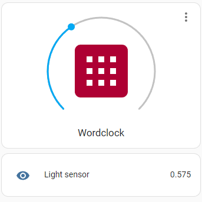

# Software

This section of the [Wordclock project](../README.md) covers the software running on the clock's ESP32.

## Features

- Supports English, French, Italian and Dutch clock faces
- Web interface over WiFi with captive portal for initial WiFi configuration
- Can use network time (NTP) or manual setting
- Interface offers various orther options such as display color, lignt sensor sensitivity, and [OTA firmware update](#ota-update)
- [MQTT client](#mqtt) to control the clock via home automation platforms such as [Home Assistant](https://www.home-assistant.io/)

## Demo video

[Here's a video](https://youtu.be/WF_X5soabm0) showing the Wordclock and its web interface in action.

## Build with PlatformIO

This is the recommended method as it makes it easy to manage dependencies and build for a specific flavor of ESP32. If you do not want to use PlatformIO, see [next section](#build-with-arduino-ide) for detailed instructions.

1. [Install PlatformIO and VS Code](https://docs.platformio.org/en/latest/integration/ide/pioide.html)
2. Load the project in VS Code (select the folder containing `platformio.ini`)
3. Verify that the target board in `platformio.ini` matches your ESP32 hardware
4. Build and upload

## Build with Arduino IDE

### Add ESP32 boards

If you want to use Arduino IDE only, you need to install the [Arduino core for the ESP32](https://github.com/espressif/arduino-esp32). To do so, the preferred method is to use the Boards Manager and is detailed [here](https://github.com/espressif/arduino-esp32/blob/master/docs/arduino-ide/boards_manager.md).

Once installed, select the ESP32 board from `Tools > Board > ESP32 Arduino > ESP32 Dev Module` (or whatever is most appropriate for your specific board).

You will also need to rename the `wordclock.cpp` file to `wordclock.ino`.

_Note: you might also need to install the appropriate USB driver for your ESP32 board (for example if it has a CP210x USB to UART bridge, it's [this one](https://www.silabs.com/developers/usb-to-uart-bridge-vcp-drivers))._

### Add required dependencies

This project relies on several additional libraries that need to be installed in the Arduino IDE. Open the Library Manager (`Tools > Manage Libraries...`), then search an add the following:

- [RTClib](https://github.com/adafruit/RTClib) by Adafruit
- [IotWebConf](https://github.com/prampec/IotWebConf) by Balazs Kelemen
- [NeoPixelBus](https://github.com/Makuna/NeoPixelBus) by Michael C. Mille

You are now ready to compile and flash the `wordclock.ino` sketch.

## OTA update

After the firwmare has been flashed over USB once, you can use the OTA feature to flash further updates: build the new binary file, then open the web portal of your clock, click the `Firmware update` link at the bottom and upload the new `.bin` file.

- If you are using PatformIO, the build file is located in `.pio\build\<environment name>\firmware.bin`.
- If you are using Arduino IDE, use `Sketch > Export compiled Binary` to export the file.

## MQTT

MQTT is a lightweight publish-subscribe protocol designed for resource-constrained devices and low-bandwidth networks, commonly used in IoT applications. MQTT clients talk via an MQTT broker (see here for [home assistant](https://www.home-assistant.io/integrations/mqtt/) instructions).

The clock's MQTT client can be enabled and configured from the web UI. Note that the clock will reboot after changing any setting if MQTT is enabled.

Topics are prefixed with the name defined as `Clock name` in the web UI settings (but converted to lowercase and with spaces removed). The default prefix is therefore `wordclock`.

### State topics
- `wordclock/availability` -> either `offline` or `online`
- `wordclock/sensor/ldr` -> current LDR reading, refreshes every 15 seconds
- `wordclock/light/color` -> current color (in `r,g,b` format)
- `wordclock/light/switch` -> current state of the display `ON` or `OFF`

### Command topics
- `wordclock/light/color/set` -> sets the LED color, payload must be an `r,g,b` formatted string
- `wordclock/light/switch/set` -> send `ON` or `OFF` to toggle the display (with a fade effect). The previously set color is restored on `ON`.

### Home Assistant configuration

Below is an configuration for Home Assistant using [light](https://www.home-assistant.io/integrations/light.mqtt/) and [sensor](https://www.home-assistant.io/integrations/sensor.mqtt/) MQTT integrations.

```yaml
mqtt:
  - light:
      name: "Wordclock"
      availability_topic: "wordclock/availability"
      state_topic: "wordclock/light/switch"
      command_topic: "wordclock/light/switch/set"
      rgb_state_topic: "wordclock/light/color"
      rgb_command_topic: "wordclock/light/color/set"
      qos: 0
      optimistic: false
  - sensor:
      name: "Light sensor"
      availability_topic: "wordclock/availability"
      state_topic: "wordclock/sensor/ldr"
```

Entities can then be arranged in a dashboard card like this one:



(the icon used for the button is `mdi:apps-box`)

## Credits

A large part of this source was based on the code from these two projects (both of which were written for the same hardware) with their explicit permission:
- https://github.com/e-noyau/wordclock (for the clockface and overall architecture)
- https://bitbucket.org/gliktaras/word-clock (for the configuration portal)
