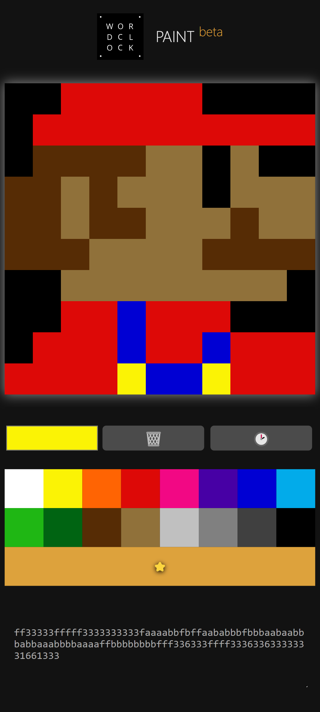

# WordClock User's Manual

## First time use

When you are powering the device for the first time after flashing the firmware, it will create its own WiFi Access Point with SSID `WordClock`.

Use your smartphone (or tablet, or computer) to detect the WiFi network, and connect to it by using the password `password` (or `12345678` in the old 1.0 firmware).

## Configuration page (Config portal)

After a successful connection to the Access Point, a configuration page should show up in your web browser (there might be a notification to tap).

It should look a bit like that:

<p align="center">
  
</p>

__Note:__ At this point even if your home network is not configured, the clock is already useable in an offline manner, especially if you have a battery cell and RTC module.

Except for password fields, you will see the item values previously set (or for first time setup, the factory default).

### Password fields

On password fields you will never see any previously set values. You can __reveal a password__ you just entered by clicking the 👁️ (eye emoji). You can then click a second time to hide the text, which is recommended before submitting the configuration form, as browsers might save clear text values to use them as suggestions.

Some fields are protected with constraints, and a validation check is performed. In case there is an error in the validation of any field, nothing is saved and a red message should appear next to the field that caused an error. You will need need to re-enter values for filled-out passwords in this case.

## Configuration options

Here are the available configuration options.

### Network

The Network section will show at the top of the page if it has not been configured before, and will afterwards move to the bottom (as shown in the screenshot above) since it probably doesn't need to change it very often.

-  __Clock name__ - defaults to `WordClock`. It will show up as SSID in Access Point mode (brifely at the beginning of every boot sequence, or if the clock is unable to connect to the configured WiFi network). You shouldn't need to change it unless you are planning to set up multiple clocks and/or use MQTT as it is also used in MQTT topics.
- __AP password__ - this password must be at least 8, at most 32 characters. **DO NOT LOSE IT** or you will need to reflash your clock. The default value is `password`. It is used in 2 situations: 
  - it's the password to the Access Point network created by the clock during intitial setup and subsequent boot sequences. The UI is forcing you to change it at this point, but you can still set it to the same default value if you want.
  - it's also the password to the clock's web interface once it is connected to your home WiFi and you type its IP in a browser (the login to this interface is always `admin`). 
- __WiFi SSID__ - The name of the WiFi network you want the clock to connect to.
- __WiFi password__ - The password of the network above. Note that it is required: open networks are not supported.

### Display

- __Startup animation__ - Enables a short animation when booting. Convenient to control that all LEDs in the matrix are working.
- __Clock face language__ - Selects which language to use for time display. See [ClockFace.cpp](wordclock/src/src/ClockFace.cpp) to check the expected layout for each.
- __Light sensor sensitivity__ - The light sensor can be used to dim the chosen display color when measured ambiant light is low.
- __Color__ - The color used by the clock to display the time. This setting is not modified when changing the color via [MQTT](#mqtt-client) (meaning that clock can return to this value after a reboot).

### Time

- __Use network time (requires WiFi)__ - Enable NTP to retrieve and periodically correct displayed time. Requires Network seettings to be configured to a WiFi network with internet access (as in AP mode the clock can't access NTP servers).
- __Time zone__ - Only shown if network time is enabled. Choose your local timezone from this list.
- __Time__ - When network time is not enabled, the current time can manually be set here. In this mode the clock does not require an internet access nor WiFi to be configured. Time is kept thanks to the coin cell battery powering the RTC chip (meaning you only need to set this once even if you reboot or unplug the clock).

### API

Enables a non password-protected [API](#api-1) and experimental [paint](#paint) web interface.

### MQTT

You can enable the MQTT client and configure your server's adress, login and password here. For more details on this feature, see the [dedicated section below](#mqtt-client).

**Note:** When this is enabled, any configuration changes will cause a reboot of the clock. Therefore it is recommended to turn it off when playing with other settings in order to avoid having to wait for the clock to reboot and reconnect to your WiFi every time.

## Connecting to a WiFi network

When you have successfully set the WiFi configuration fields, the device will try to connect to it.

If the connection fails, the device will __fall back to Access Point
mode__. This means that the device will form its own WiFi network again, to which you can connect to and try to correct the network setup. This time you will see the __Clock name__ value as the access point name (SSID) - `WordClock` if you haven't changed it - and you need to use the __AP password__ that you should have configured previously.

Note that in such a case where the configured WiFi network is not connecting, the device will fall back to Access Point mode only for a few seconds as it will periodically __retry connecting to it__. After all, maybe your configuration was OK and it's your WiFi that was down 🙂.

Once you connect in Access Point mode, it will be kept running as long as any device is connected to it. You'll need to disconnect your device from it for the clock to continue its operation (ie reboot).

## Configuration in connected mode

After the clock successfully connects to the configured WiFi network, the temporary Access Point is terminated, but you can still access the clock using its IP address.

To determine the IP address of your clock, you might want to consult with your WiFi router (it might also be possible to use a local domain such as `wordclock.lan`, `wordclock.home` or `wordclock.local`, but this mostly depends on your router so your mileage may vary).

When you want to access the Config Portal of the clock __via a home WiFi network__ from your web browser, a login prompt will be displayed, where you need to enter:
- User name: `admin`
- Password: the password you have set up previously as __AP Password__ (`password` if you kept the default value).

You will then land on the same configuration interface as seen in Access Pont mode.

#### Security notes connecting from WiFi network

The clock currently doesn't support SSL. To make things a bit more secure and avoid compromission, you can:
- Prefer making config changes in Access Point mode rather than when connected to your home network
- Set up a dedicated WiFi network for your IoT devices

## API

The API is disabled by default because it is not secured. It was created to allow the [Paint](#paint) web interface to work, but could be used directly as well.

When enabled, the following routes are activated:
- `http://<clock IP>/api/color/get` -> returns the HTML code of the currenly set color
- `http://<clock IP>/api/matrix/set/<payload>` -> activates Paint mode and displays the payload, see [Paint](#paint) for details
- `http://<clock IP>/api/matrix/unset` -> exits Paint mode and returns to displaying time
- `http://<clock IP>/api/text/set` -> scrolls a custom text, then returns to displaying time, see [Text scroller](#text-scroller) for details

## MQTT client

MQTT is a lightweight publish-subscribe protocol designed for resource-constrained devices and low-bandwidth networks, commonly used in IoT applications. MQTT clients talk via an MQTT broker (see here for [Home Assistant](https://www.home-assistant.io/integrations/mqtt/) instructions).

The clock's MQTT client can be enabled and configured from the web UI. Note that the clock will reboot after changing any setting if MQTT is enabled.

Topics are prefixed with the name defined as `Clock name` in the web UI settings (but converted to lowercase and with spaces removed). The default prefix is therefore `wordclock`.

### State topics
- `wordclock/availability` -> either `offline` or `online`
- `wordclock/sensor/ldr` -> current raw LDR reading (0-4095), refreshes every 15 seconds
- `wordclock/light/color` -> current color (in `r,g,b` format)
- `wordclock/light/switch` -> current state of the display `ON` or `OFF`

### Command topics
- `wordclock/light/color/set` -> sets the LED color, payload must be an `r,g,b` formatted string
- `wordclock/light/switch/set` -> send `ON` or `OFF` to toggle the display (with a fade effect). The previously set color is restored on `ON`.

#### Matrix paint (experimental)
- `wordclock/light/matrix/set` -> activates Paint mode and displays the payload, a 110 characters string using a preset palette, see [Paint](#paint)
- `wordclock/light/matrix/unset` -> exits Paint mode and returns to displaying time

#### Text scroller (experimental)
- `wordclock/light/text/set` -> activates Text Scroller mode and displays the payload text, see [Text Scroller](#text-scroller)

### Home Assistant configuration

Below is an example configuration for Home Assistant using [light](https://www.home-assistant.io/integrations/light.mqtt/) and [sensor](https://www.home-assistant.io/integrations/sensor.mqtt/) MQTT integrations.

```yaml
mqtt:
  - light:
      name: "Wordclock"
      availability_topic: "wordclock/availability"
      state_topic: "wordclock/light/switch"
      command_topic: "wordclock/light/switch/set"
      rgb_state_topic: "wordclock/light/color"
      rgb_command_topic: "wordclock/light/color/set"
      qos: 0
      optimistic: false
  - sensor:
      name: "Light sensor"
      availability_topic: "wordclock/availability"
      state_topic: "wordclock/sensor/ldr"
```

Entities can then be arranged in a dashboard card like this one:

<p align="center">
  
</p>

(the icon used for the button is `mdi:apps-box`)

## Paint

__Note:__ This is an experimental feature. Payload format, palette and APIs might change.

When the [API toggle](#api) is enabled, a web interface becomes available at `http://<clock ip>/paint`.

It is a basic real time drawing tool that allows you to take control of the clock's LED matrix. While it is fun to just play with, it is meant to easily create custom icons to be used in a home automation setup.

<p align="center">
  
</p>

To keep thing simple, the system works with 16 preset colors based on the original 4-bit palette of the 1987 Macintosh II:

<table style="border: none;">
<tbody><tr>
  <td style="color:black; background:#fff;">0 — white
  </td>
  <td style="color:black; background:#fbf305;">1 — yellow
  </td>
  <td style="color:black; background:#ff6403;">2 — orange
  </td>
  <td style="background:#dd0907;">3 — red
  </td>
  <td style="color:white; background:#f20884;">4 — magenta
  </td>
  <td style="background:#4700a5;">5 — purple
  </td>
  <td style="background:#0000d3;">6 — blue
  </td>
  <td style="color:black; background:#02abea;">7 — cyan
  </td>
</tr>
<tr>
  <td style="color:white; background:#1fb714;">8 — green
  </td>
  <td style="color:white; background:#006412;">9 — dark green
  </td>
  <td style="color:white; background:#562c05;">a — brown
  </td>
  <td style="background:#90713a;">b — tan
  </td>
  <td style="color:black;background: silver;">c — light grey
  </td>
  <td style="background: grey;">d — medium grey
  </td>
  <td style="background:#404040;">e — dark grey
  </td>
  <td style="color:white; background:#000;">f — black
  </td>
</tr>
</tbody></table>

Source: [Wikipedia](https://en.wikipedia.org/wiki/List_of_software_palettes)

Other buttons:

- The ⭐ (star) is an additional 17th color that matches whatever color is currently used to display the time in normal operation; you can therefore customize it.

- The 🗑️ (trashcan) clears the screen (turns all LEDs black).

- The 🕑 (clock) transitions the clock back in normal time display mode. Rember to use this when you're done painting or the clock will remain in paint mode indefinitely (or until reboot).

### Payload format

At the bottom of the page, a text version of the image payload is displayed, so it can be copied and used in direct [MQTT](#mqtt-client) or [HTTP GET](#api-1) calls, for example to be used in home automation scenarios.

The payload is a string of 110 characters, one for each LED/pixel in the 11x10 matrix, starting from the top left corner. Allowed values are:

- `0` to `f` representing the hexadecimal index of one of the 16 colors from the preset palette,
- `x` representing whatever color is currently selected for displaying the time.

## Text scroller

__Note:__ This is an experimental feature. Parameters might change.

This feature scrolls a text on the display (only ASCII characters are supported) then goes back to displaying the time. It accepts a string of any length between 1 and 200 characters.

It can be used from the [API](#api-1) and from [MQTT](#mqtt-client). Both options support the same parameters.

#### Parameters

The feature supports a few optional parameters:

- `color` should match a character code from the [Paint](#paint) palette, i.e. `0` to `f` or `x`, see [payload format](#payload-format). Defaults to the current color (`x`).
- `delay` define the time in milliseconds between each frame. The lower the number, the faster the scroll speed. Defaults to 200.
- `rtl` if set to `1`, scroll from right to left. Defaults to left to right.

#### API

When the API endpoint is enabled in the [settings](#api), you can hit `http://<clock IP>/api/text/set/<custom text>` and pass the optional settings as query parameters. For example to scroll the message `Hello from API :)` in red color, scrolling backwards with 100ms delay, you'd do:

```
http://<clock IP>/api/text/set/Hello%20from%20API%20%3A)?color=3&delay=100&rtl=1
```

Note: the API endpoint can handle URI-encoded characters.

#### MQTT topic

The MQTT command topic is `wordclock/light/text/set` and its paylod is expected to be a JSON string containing the `text` value to scroll alongside any supported optional parameters. For example:

```json
{"text":"Hello from MQTT :)","color":"3","delay":100,"rtl":1}
```

## Credits

Parts of this page are inspired from the [template manual provided by IotWebConf](https://github.com/prampec/IotWebConf/blob/master/doc/UsersManual.md).
